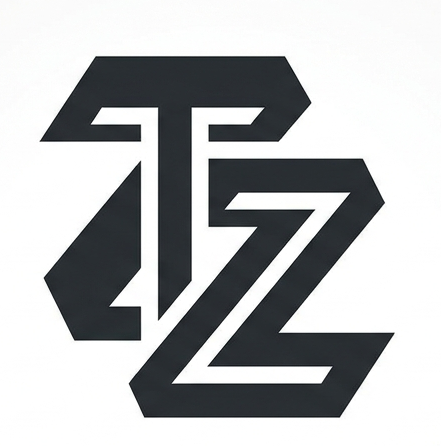
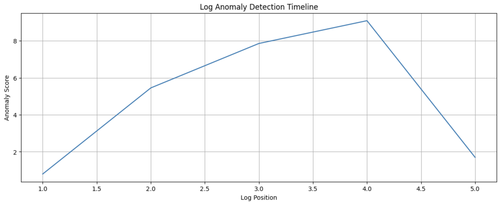

<p align="center">
  
</p>

<h1 align="center">LogFormer_1</h1>

<p align="center">
  <strong>A Lightweight Transformer-Based Log Anomaly Detection System</strong>
</p>

<p align="center">
  <a href="https://github.com/OpenTirZ/LogFormer_1/releases/tag/v1.0">
    
  </a>
  <a href="https://github.com/OpenTirZ/LogFormer_1/blob/main/LICENSE">
    
  </a>
  
  
  
</p>

<p align="center">
  <a href="#overview">Overview</a> •
  <a href="#problem-statement">Problem</a> •
  <a href="#approach">Approach</a> •
  <a href="#model-architecture">Architecture</a> •
  <a href="#anomaly-detection">Anomaly Detection</a> •
  <a href="#project-structure">Project Structure</a> •
  <a href="#getting-started">Getting Started</a> •
  <a href="#results">Results</a> •
  <a href="#future-work">Future Work</a>
</p>

---

## Overview

LogFormer_1 is a lightweight Transformer-based log anomaly detection system designed for industrial log analysis. The model learns normal log event patterns from historical system logs and identifies unusual behavior using next-event prediction. By treating log events as tokens — similar to how language models process words in a sentence — LogFormer_1 learns the sequential structure of system behavior and flags deviations that may indicate failures, misconfigurations, or attacks.

Built on a compact GPT-style Transformer architecture, LogFormer_1 is designed to be lightweight and trainable on Google Colab, making it accessible for researchers and practitioners working with industrial log data. The system operates in an unsupervised manner: it requires only normal log sequences for training and detects anomalies by measuring how unexpected observed events are relative to learned patterns.

## Problem Statement

Modern distributed systems generate massive volumes of log data every second. These logs are the primary source of operational intelligence — they record every significant system event, from block allocation and replication to error handling and exception reporting. However, manually sifting through millions of log lines to find anomalous behavior is not only impractical but also error-prone.

Traditional rule-based monitoring systems rely on predefined patterns and thresholds to flag issues. While effective for known failure modes, they fundamentally cannot detect unseen or novel failures — the very failures that are often the most critical. As systems grow in complexity, the gap between what rules can catch and what actually goes wrong continues to widen.

LogFormer_1 addresses this challenge by learning the normal sequential behavior of log events directly from data. Instead of relying on handcrafted rules, it uses a Transformer model to capture the statistical patterns of normal log sequences and identifies anomalies as events that deviate significantly from these learned patterns. This approach generalizes to previously unseen failure types, making it far more robust than traditional methods.

## Dataset

LogFormer_1 is evaluated on the **HDFS (Hadoop Distributed File System) Log Dataset**, a widely-used benchmark in the log analysis community.

| Property | Details |
|----------|---------|
| **Dataset** | HDFS Log Dataset |
| **Structured Log File** | `HDFS_2k.log_structured.csv` |
| **Template File** | `HDFS_2k.log_templates.csv` |
| **Event Templates** | E1 – E14 |

Each `EventId` (E1 through E14) represents a specific system action such as:

- **Block allocation** — Assigning storage blocks to files
- **Block transfer** — Moving data blocks between nodes
- **Block replication** — Creating redundant copies for fault tolerance
- **Block deletion** — Releasing unused storage blocks
- **Block verification** — Integrity checks on stored data
- **Exception handling** — Logging errors, warnings, and recovery actions

The model treats these event IDs as discrete tokens in a vocabulary, learning the transitional probabilities between events in normal system operation.

## Approach

LogFormer_1 follows a systematic pipeline from raw log data to anomaly scores:

```
┌─────────────┐    ┌──────────────┐    ┌───────────────────┐    ┌────────────────┐
│  Raw Logs   │───▶│  Log Parsing  │───▶│  Event Tokenization│───▶│ Sliding Window │
└─────────────┘    └──────────────┘    └───────────────────┘    └───────┬────────┘
                                                                             │
                                                                             ▼
┌──────────────┐    ┌───────────────┐    ┌──────────────────┐    ┌────────────────┐
│ Anomaly Flag │◀───│ Anomaly Score │◀───│ Probability Calc  │◀───│  Transformer   │
└──────────────┘    └───────────────┘    └──────────────────┘    └────────────────┘
```

1. **Parse Logs** — Raw log messages are parsed into structured event IDs using a log parser.
2. **Tokenize Events** — Event IDs are mapped to numerical tokens for model consumption.
3. **Create Sequences** — Training sequences are generated using a sliding window over event histories.
4. **Train Transformer** — A GPT-style Transformer is trained to predict the next event in a sequence.
5. **Compute Probabilities** — During inference, the model outputs the probability distribution over possible next events.
6. **Score Anomalies** — Anomaly scores are computed using negative log probability of the actual observed event.
7. **Flag Anomalies** — Events with high anomaly scores are flagged as potential anomalies.

## Model Architecture

LogFormer_1 implements a compact GPT-style Transformer optimized for log event prediction:

| Component | Details |
|-----------|---------|
| **Token Embedding** | Maps event IDs to dense vector representations (dim = 128) |
| **Positional Embedding** | Injects sequential position information into embeddings |
| **Multi-Head Self Attention** | 4 attention heads for capturing event dependencies |
| **Feed-Forward Network** | Two-layer MLP with GELU activation |
| **Layer Normalization** | Pre-norm architecture for stable training |
| **Prediction Head** | Linear projection to vocabulary size for next-event prediction |

### Configuration

| Hyperparameter | Value |
|----------------|-------|
| Vocabulary Size | 14 (E1–E14) |
| Context Length | 10 |
| Embedding Dimension | 128 |
| Attention Heads | 4 |
| Transformer Layers | 4 |
| Activation | GELU |

### Example

```
Input Sequence:  [E1] [E2] [E4] [E5]
                        │
                ┌───────▼───────┐
                │  Transformer   │
                │  (4 layers)    │
                └───────┬───────┘
                        │
                Predicted: [E6]
```

The model learns normal event transitions and predicts the most likely next event. If the actual event deviates significantly from the prediction, it receives a high anomaly score.

## Anomaly Detection

LogFormer_1 uses a principled probabilistic approach to anomaly detection. During inference, the trained model computes the probability of each possible next event given the preceding context. The anomaly score for an observed event is defined as:

```
score = -log(P(actual_event | context))
```

- **Low score** → The event was expected given the context → **Normal behavior**
- **High score** → The event was unexpected given the context → **Potential anomaly**

This formulation naturally assigns higher anomaly scores to events that are rare or inconsistent with learned patterns, without requiring any labeled anomaly data during training.

## Project Structure

```
LogFormer_1/
├── Attention/
│   └── MultiHeadAttention.py    # Multi-head self-attention mechanism
├── Data/
│   └── data.py                  # Data loading and preprocessing
├── Dataloader/
│   └── dataloader.py            # PyTorch DataLoader utilities
├── FeedForward/
│   └── FeedForward.py           # Position-wise feed-forward network
├── GELU/
│   └── GELU.py                  # GELU activation function
├── LayerNorm/
│   └── LayerNorm.py             # Layer normalization module
├── Testing/
│   ├── test.py                  # Anomaly scoring and evaluation
│   └── test.png                 # Anomaly score visualization
├── Transformer/
│   └── Transformer.py           # Transformer block composition
├── Logo.png                     # Project logo
├── main.py                      # Training entry point
└── training.log                 # Training logs with loss curves
```

## Getting Started

### Prerequisites

```bash
pip install torch pandas numpy matplotlib
```

### Training

```bash
python main.py
```

This will:
- Load and preprocess the HDFS log dataset
- Build training sequences using a sliding window
- Train the Transformer model with next-event prediction
- Save training logs to `training.log`

### Anomaly Detection

```bash
python Testing/test.py
```

This will:
- Load the trained model
- Calculate anomaly scores for test sequences
- Generate visualization plots (saved as `Testing/test.png`)

### Quick Start on Google Colab

LogFormer_1 is designed to be lightweight enough to train on Google Colab:

1. Clone the repository
2. Upload the HDFS dataset files to your Colab environment
3. Run `main.py` to train the model
4. Run `Testing/test.py` to evaluate and visualize anomaly scores

## Results

<p align="center">
  
</p>

<p align="center"><em>Anomaly score distribution across test log sequences</em></p>

The visualization above shows the anomaly scores computed for test log sequences. Peaks in the score indicate events that deviate significantly from the learned normal patterns — these are the detected anomalies.

## Features

- **Transformer-Based Architecture** — Leverages self-attention for capturing long-range dependencies in log sequences
- **Lightweight & Efficient** — Trainable on Google Colab with minimal computational resources
- **Unsupervised Detection** — Requires only normal log data for training; no labeled anomalies needed
- **Industrial Log Analysis** — Designed for real-world distributed system logs
- **Event-Level Scoring** — Granular anomaly scores at the individual event level
- **Attention-Based Modeling** — Captures complex sequential patterns that rule-based systems miss

## Tech Stack

| Technology | Purpose |
|------------|---------|
|  | Core language |
|  | Deep learning framework |
|  | Data manipulation |
|  | Numerical computing |
|  | Visualization |

## Future Work

- 🔍 **Attention Visualization** — Visualize attention weights to understand which past events influence predictions
- 🔬 **Root Cause Analysis** — Extend the model to not only detect anomalies but also identify their root causes
- 🔮 **Failure Prediction** — Predict imminent failures before they occur based on early warning patterns
- ⚡ **Real-Time Monitoring** — Deploy the model as a streaming service for live log monitoring
- 📊 **Larger Datasets** — Evaluate and scale to larger industrial log datasets (BGL, Thunderbird, Spirit)
- 🛡️ **Robustness Testing** — Systematic evaluation against adversarial and distribution-shift scenarios

## Project Goal

Build a practical and efficient Transformer-based anomaly detection system that can learn system behavior from logs and automatically identify unusual events in large-scale distributed systems. LogFormer_1 represents the first step toward intelligent, automated log analysis powered by modern deep learning.

---

<p align="center">
  
  <br/>
  <strong>OpenTirZ</strong> • Building Intelligent Systems
  <br/><br/>
  <a href="https://github.com/OpenTirZ/LogFormer_1">
    
  </a>
  <a href="https://github.com/OpenTirZ/LogFormer_1">
    
  </a>
</p>
